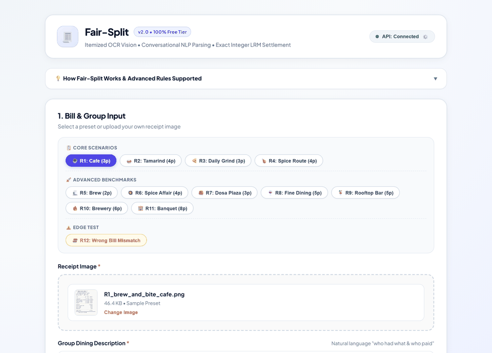
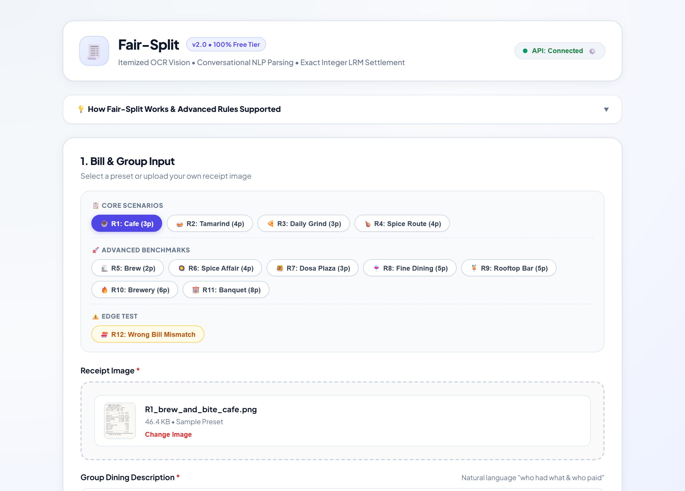
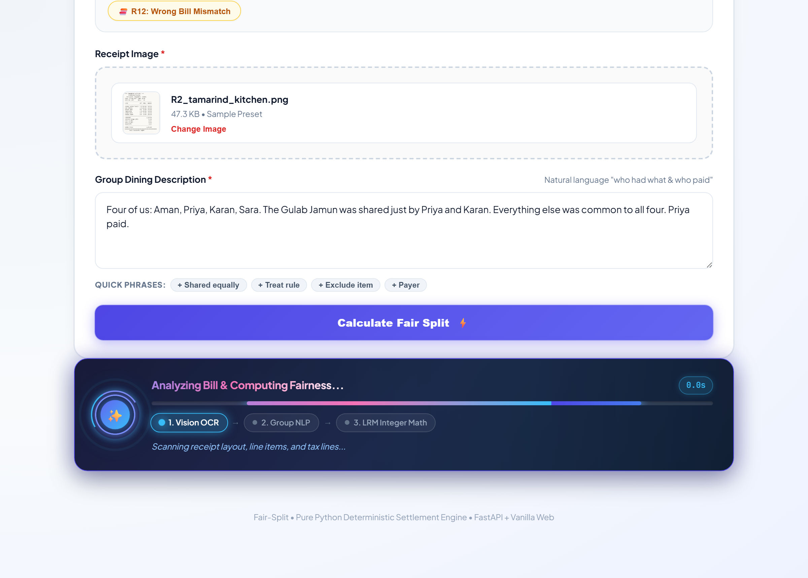
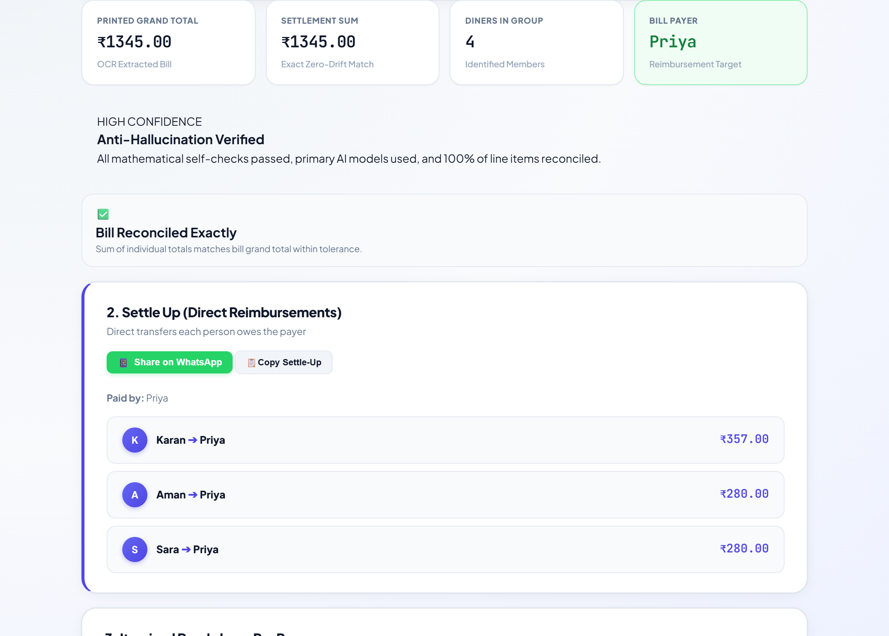
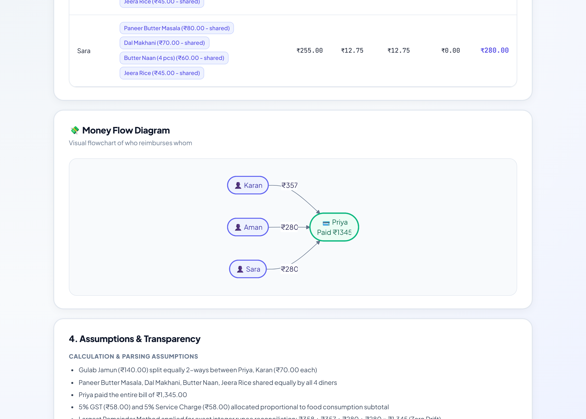
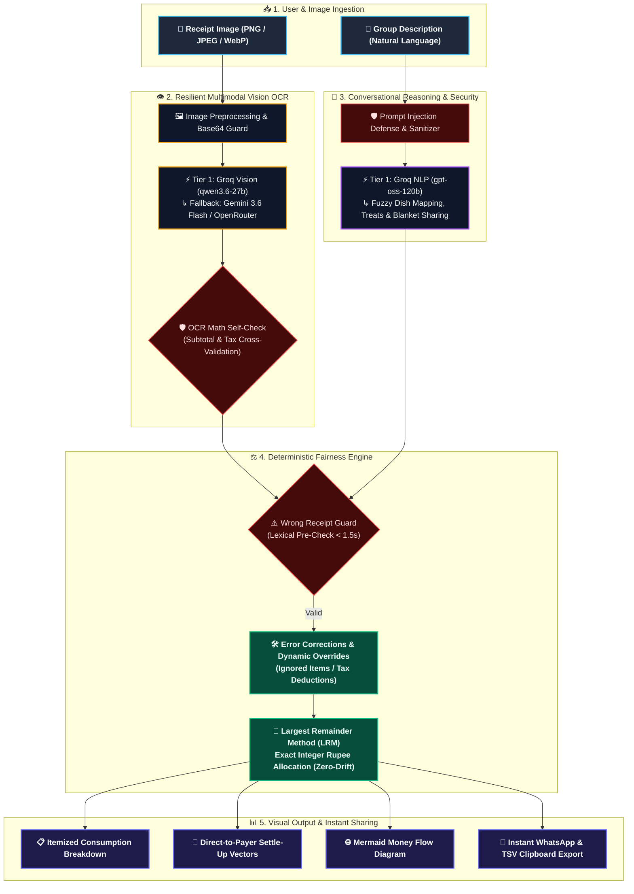

# Fair-Split — Itemized Bill Splitting & Fairness Engine

[](https://fastapi.tiangolo.com)
[](https://python.org)
[](https://pydantic.dev)
[](https://docker.com)
[](LICENSE)

**Fair-Split** is a production-grade, deterministic receipt OCR and natural language group bill settlement engine. It extracts line items from complex receipt images, parses conversational dining descriptions, handles multi-person sharing rules and restaurant math corrections, and computes mathematically exact settle-up transfers down to the single rupee.

<p align="center">
  
</p>

---

## 📸 Interface & Capabilities Showcase

<div align="center">
  <table>
    <tr>
      <td width="50%">
        <h4 align="center">1. Input & Presets Dashboard</h4>
        
      </td>
      <td width="50%">
        <h4 align="center">2. High-Energy Scanner Animation</h4>
        
      </td>
    </tr>
    <tr>
      <td width="50%">
        <h4 align="center">3. Exact LRM Reconciliation Results</h4>
        
      </td>
      <td width="50%">
        <h4 align="center">4. Visual Money Flow & Settle-Up</h4>
        
      </td>
    </tr>
  </table>
</div>

---

## 🌟 Key Capabilities & System Architecture



### 1. Multimodal OCR with Multi-Tier Fallback (`backend/extraction.py`)
- **Tier 1 (Primary Vision Engine)**: Groq Vision (`qwen/qwen3.6-27b`).
- **Tier 2 (Secondary Vision Engine)**: Google Gemini Vision (`gemini-3.6-flash`).
- **Tier 3 (Zero-Cost Vision Fallback)**: OpenRouter Vision (`google/gemma-4-26b-a4b-it:free`).
- **Mathematical Self-Check Verification**: Verifies line-item subtotal addition against the printed grand total and flags OCR discrepancies before settlement.

### 2. Group Dining Description Parser (`backend/description_parser.py`)
- **Tier 1 (Primary Text Engine)**: Groq (`openai/gpt-oss-120b`).
- **Tier 2 (Secondary Text Engine)**: Google Gemini (`gemini-3.6-flash`).
- **Tier 3 (Zero-Cost Text Fallback)**: OpenRouter (`nvidia/nemotron-3-super-120b-a12b:free`).
- **Fuzzy Item Mapping**: Resolves shorthand dish references (e.g. *"tikka"* $\to$ *"Chicken Tikka Starter"*, *"naan"* $\to$ *"Garlic Naan"*).
- **Arbitrary Partial Sharing**: Handles 2-of-4, 3-of-6, or fractional dish sharing with equal subtotal allocation.
- **Blanket Statements**: Intelligently handles statements like *"everything else was shared equally by all"*.
- **The "TREAT / COVER" Rule**: If person X treats person Y to a dish, the financial cost falls on X while Y owes ₹0.

### 3. Receipt Error Correction Engine (`backend/compute.py`)
- **Ignored Items**: If the restaurant mistakenly charged for an item the group didn't eat, stating it in the description drops the item and automatically deducts its amount from the adjusted grand total.
- **Tax Overrides**: If the receipt double-counted tax, specifying the correct tax pool dynamically overrides the OCR value.
- **Wrong Receipt Guard**: Catching completely mismatched receipts (e.g. coffee bill for a steak dinner description) and gracefully rejecting the request with an actionable HTTP 422 in under 1.5s.

### 4. Deterministic Settlement & Exact Integer Reconciliation
- **Largest Remainder Method (LRM)**: Pure Python integer allocation guaranteeing $\sum P_i \equiv T$ (sum of person totals equals grand total) with zero paisa drift.
- **Proportional Taxes & Discounts**: GST and service charges are strictly distributed proportional to each diner's pre-tax food subtotal.
- **Direct-to-Payer Transfers**: Generates minimal reimbursement vectors (`from_person` $\to$ `to_person`).

### 5. Production Security & Hardening
- **Prompt Injection Defense**: Strips jailbreak attempts (`[INST]`, `ignore previous instructions`) and bounds input sizes.
- **Anti-Hallucination Guard**: Flags impossible unit prices (> ₹50,000) or astronomical bill totals.
- **Rate Limiting**: Integrated `slowapi` at 20 requests/minute per IP with proxy header awareness (`X-Forwarded-For`).
- **Distributed Request Tracing**: Every request is assigned a `UUID4` returned via `X-Request-ID`.

### 6. Interactive Visualization & UI
- **Mermaid.js Money Flow**: Interactive visual graph showing who owes whom at a glance.
- **Self-Contained SPA**: Zero-build vanilla HTML5, CSS3, and JavaScript served directly by FastAPI or standalone.
- **Instant Export Actions**: One-click **Copy Table (TSV)**, **Copy Settle-Up**, and **Share on WhatsApp**.

---

## 📁 Repository Structure

```text
├── backend/
│   ├── __init__.py
│   ├── compute.py              # Deterministic LRM math & correction engine
│   ├── cross_check.py          # Bidirectional consistency validation
│   ├── description_parser.py   # Natural language consumption parser
│   ├── extraction.py           # Multi-provider receipt OCR & self-check
│   ├── guardrails.py           # Prompt injection defense & hallucination guards
│   ├── llm_provider.py         # Multi-tier provider abstraction & fallback handling
│   ├── main.py                 # FastAPI application with rate limiting & SPA mounting
│   └── models.py               # Pydantic schemas (ReceiptData, SplitResult, etc.)
├── frontend/
│   ├── app.js                  # Frontend controller & dynamic DOM rendering
│   ├── index.html              # Responsive single-page application UI
│   ├── style.css               # Design system & tokens
│   └── samples/                # Sample receipts (R1–R12)
├── docs/
│   ├── ai_was_wrong.md         # Documented failure modes and preventive architecture
│   ├── edge_cases.md           # Analysis of 11 complex real-world edge cases
│   └── prompt_log.md           # Prompt version history & system instructions
├── tests/
│   ├── test_guardrails.py      # Unit tests for injection, bounds, sanitization
│   ├── test_robustness_scenarios.py # Fuzzy matching, corrections, 2-person sharing
│   ├── test_frontend_complete.py    # Static server & end-to-end split simulation
│   └── sample_receipts/        # Benchmark receipt dataset (R1–R12)
├── Dockerfile                  # Production container definition
├── docker-compose.yml          # One-command compose deployment
├── render.yaml                 # Cloud Blueprint deployment config
├── Procfile                    # Web service process definition
├── requirements.txt            # Strictly pinned production dependencies
├── .env.example                # Sample environment configuration
└── README.md
```

---

## 🆓 100% Free Tier Setup ($0 Spend Architecture)

This application is engineered specifically to run **entirely on free-tier API keys with zero paid subscriptions or credit card requirements**:

| Tier | Provider | Role in Fair-Split | Free Model Used | Where to Get Free Key ($0) |
|---|---|---|---|---|
| **Tier 1 (Primary)** | **Groq** | Primary Vision & Text | `qwen/qwen3.6-27b` & `openai/gpt-oss-120b` | [console.groq.com](https://console.groq.com) (Instant free signup) |
| **Tier 2 (Secondary)** | **Google Gemini** | Secondary Vision OCR & NLP | `gemini-3.6-flash` | [aistudio.google.com](https://aistudio.google.com) (Free 15 RPM / 1,500 RPD) |
| **Tier 3 (Fallback)** | **OpenRouter** | Zero-Cost Fallback | `google/gemma-4-26b-a4b-it:free` & `nvidia/nemotron-3-super-120b-a12b:free` | [openrouter.ai](https://openrouter.ai) (100% free `:free` models) |

### Automatic 429 Graceful Degradation
When running on free tiers, provider rate limits can occasionally be triggered. **Fair-Split is built with zero-failure graceful degradation**:
1. If Groq hits a free rate limit (429) or timeout, it automatically fails over to Gemini in 0ms.
2. If Gemini hits a rate limit or error, it automatically routes to OpenRouter's `:free` models.
3. The user's bill is always split accurately without ever failing or requiring a paid plan.

---

## 🎯 Preset Test Scenarios (R1 – R12)

The application includes **12 real-world dining scenarios** pre-loaded as clickable chips in the UI:

### Core Dining Scenarios (R1 – R4)
| Preset | Venue Type | Key Complexity & Group Tested |
|---|---|---|
| **R1** | **Brew & Bite Café** (Bengaluru) | 3 diners (Ravi, Neha, Sameer) &bull; Itemized cafe dishes &bull; Sameer paid |
| **R2** | **Tamarind Kitchen** (Bengaluru) | 4 diners (Aman, Priya, Karan, Sara) &bull; Partial sharing (Priya & Karan) &bull; Blanket sharing &bull; Priya paid |
| **R3** | **The Daily Grind** (Mumbai) | 3 diners (Ishaan, Meera, Rohit) &bull; Equal sharing &bull; 2-person alcohol subset &bull; Rohit paid |
| **R4** | **Spice Route** (Hyderabad) | 4 diners (Dev, Nikhil, Anjali, Farah) &bull; 15% WELCOME15 coupon &bull; Service charge &bull; Anjali paid |

### Advanced Stress-Test & Hardened Benchmarks (R5 – R11)
| Preset | Venue Type | Key Complexity Tested |
|---|---|---|
| **R5** | **Filter & Brew Cafe** | 2-person breakfast &bull; Single payer &bull; Thermal print layout |
| **R6** | **Spice Affair** | 4-person Indian dining &bull; Multi-portion curries &bull; Unmentioned item fairness fallback &bull; Shared naans |
| **R7** | **Dosa Plaza** | 3-person South Indian QSR &bull; Multi-combo dishes &bull; Beverage sharing |
| **R8** | **Olive & Vine** | 5-person fine dining &bull; Course-by-course sharing &bull; Wine sharing |
| **R9** | **Sky High Lounge** | 5-person rooftop lounge &bull; Alcohol vs non-alcoholic split &bull; Bar snacks |
| **R10** | **The Urban Brewery Feast** | 6-person group &bull; 10 items &bull; Multi-tax GST &bull; 15% discount &bull; Treat rule |
| **R11** | **The Grand Meridian Hotel** | 8-person banquet &bull; 19 items &bull; Dual GST slabs &bull; ₹15,000 advance deposit |

### Edge Test (R12)
| Preset | Venue Type | Key Complexity Tested |
|---|---|---|
| **R12** | **Mismatched Bill Guard** | Completely unrelated bill vs dining description &bull; Rejection in <1.5s with zero hallucination |


---

## 🚀 Quickstart Guide

### Option 1: Run with Docker Compose (Recommended)

```bash
# 1. Clone repository
git clone <repo-url>
cd fair-split

# 2. Configure environment
cp .env.example .env
# Edit .env with your GEMINI_API_KEY and GROQ_API_KEY

# 3. Start the application
docker compose up --build
```

Open **`http://localhost:8000`** in your browser.

---

### Option 2: Run Locally with Python

```bash
# 1. Create and activate virtual environment
python -m venv venv
source venv/bin/activate  # On Windows: venv\Scripts\activate

# 2. Install pinned dependencies
pip install -r requirements.txt

# 3. Set environment variables
cp .env.example .env
# Edit .env with your API keys

# 4. Start backend server (serves both API and Frontend SPA)
uvicorn backend.main:app --host 0.0.0.0 --port 8000 --reload
```

- **Web App**: `http://localhost:8000`
- **Interactive Swagger Docs**: `http://localhost:8000/docs`
- **Service Health**: `http://localhost:8000/health`

---

## 🧪 Running the Test Suite

```bash
# Run guardrail, sanitization & injection tests
pytest tests/test_guardrails.py

# Run math correctness, receipt corrections & fuzzy matching tests
python tests/test_robustness_scenarios.py

# Run integrated full-stack simulation test
python tests/test_frontend_complete.py
```

---

## 📡 API Specification

### `POST /split`
Processes a receipt image and consumption description to return itemized allocations.

**Request Body (`application/json`)**:
```json
{
  "receipt_base64": "<base64_encoded_image_bytes>",
  "description": "Four of us: Rohan, Divya, Arjun, Preethi. Rohan and Arjun shared the Butter Chicken. Divya had Palak Paneer. Rohan paid."
}
```

**Response (`200 OK`)**:
```json
{
  "per_person": [
    {
      "name": "Rohan",
      "items": [{"name": "Butter Chicken", "amount": 270.0, "is_shared": true}],
      "subtotal": 270.0,
      "tax_share": 13.5,
      "service_share": 0.0,
      "discount_share": 0.0,
      "total": 284.0
    }
  ],
  "grand_total": 1345.0,
  "reconciliation": {
    "sum_of_person_totals": 1345.0,
    "matches_bill": true
  },
  "paid_by": "Rohan",
  "settle_up": [
    {
      "from_person": "Divya",
      "to_person": "Rohan",
      "amount": 350.0
    }
  ],
  "assumptions": ["Direct-to-payer settle-up transactions generated"],
  "flags": [],
  "confidence": {
    "level": "high",
    "reasons": []
  }
}
```

---

## 🔒 Production Deployment Checklist

- [x] **Zero Port Conflict**: Single-service architecture (FastAPI mounts Frontend SPA).
- [x] **Load Balancer Ready**: Uvicorn configured with `--proxy-headers --forwarded-allow-ips="*"`.
- [x] **Rate Limiting**: 20 requests/minute per client IP via SlowAPI.
- [x] **Fail-Safe Fallbacks**: Multi-model vision and text routing (Gemini $\to$ Groq $\to$ OpenRouter).
- [x] **Memory Capped**: Base64 payload capped at 28MB; descriptions capped at 3,000 characters.
- [x] **Client-Side Guard**: 20MB file size limit enforced before Base64 encoding in the browser.
- [x] **Deterministic Math**: Largest Remainder Method prevents floating point penny rounding errors.
- [x] **No Unhandled Errors**: User-friendly UI error translation for 422, 504, 429, and 500 status codes.
